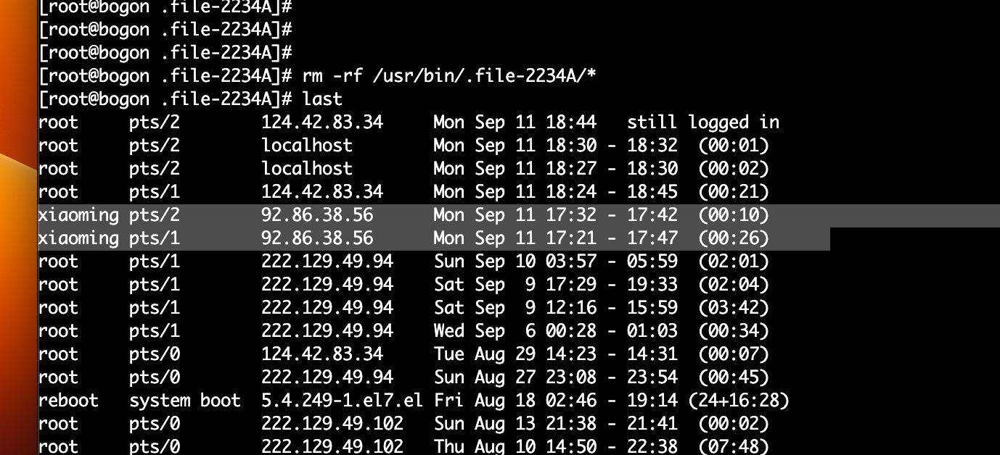

# 被植入木马Syst3md挖矿
由于种种原因，需要自己搭建服务器，于是买来了硬件，托管在朋友家中，委托他帮忙装系统，然后他装好了系统之后，随手将root密码设置成了xiaoming，并且还有一个新用户也叫做xiaoming。隐患就此开始...
## 第一次发现木马
由于被挖矿，导致elasticsearch宕机了，我去重启es发现无法启动，诡异的事情发生了。

于是执行了```top```命令,查看被一个莫名的应用占满了CPU。

毫无疑问我的服务器被挖矿了，赶快去删除掉他


## 开始尝试删除
查看是否有登陆日志，其中确实有两条未知用户通过xiaoming来登陆我的服务器

这时候黑客往往会配置ssh免密登陆，防止我修改密码，快去root目录看下有没有.ssh文件

真的有，赶紧删除掉

```shell
cd /root/.ssh
sudo chattr -i authorized_keys
sudo rm -rf authorized_keys
```
:::tip 注意
-i 是chattr命令的选项，表示将文件设置为不可改写（immutable）。当文件被标记为不可改写时，任何尝试修改或删除该文件的操作都将受到限制，即使以超级用户权限运行也无法更改它
:::


这时候发现前面删除的木马程序又运行回来了，感觉一定是定时任务，赶紧去看看定时任务
```shell
crontab -l
```
他把我所有的定时任务都删除了，然后添加了他自己的定时任务，真可恶


```shell
crontab -e
```

将它的所有定时任务注释掉，看看还是否会定时执行。
果不其然，又重新给我写了配置文件。

## 寻找后门(控制写定时文件的)
一定有后门，一直在循环反复的写定时任务，只能找到这个最后的元凶，才有可能解决这个问题。